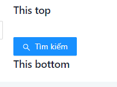
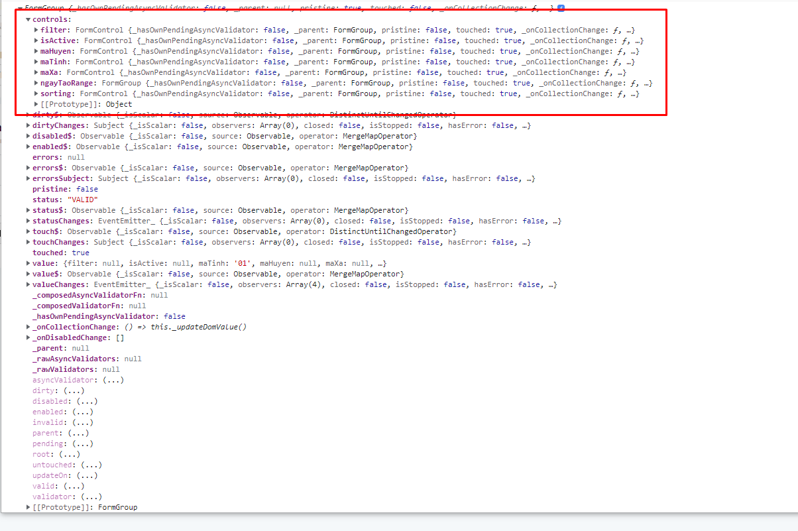
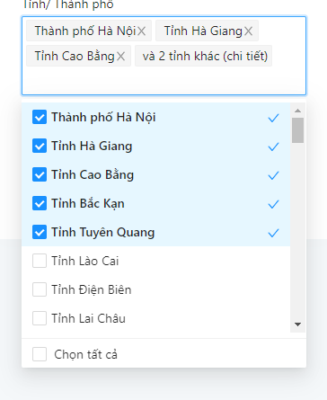

**Hướng dẫn sử dụng ord form dynamic**

**1. Basic Usage**

Html

```html 
<of [schemaModel]="schema"></of>
```

Ts

```
constructor(private fw: FormWidgetFacadeService) {
}
schema = new OfSchemaModel({
  fieldObject: {
    filter: this.fw.base.text({
      label: 'Từ khóa tìm kiếm',
      grid: this.fw.getGridByWidth(24),
      placeholder: 'Nhập tên/ mã huyện để tìm kiếm',
      allowEnterKeySearch: true
    }), maTinh: {
      ...this.fw.selectControl.tinh(),
      grid: this.fw.getGridByWidth(24)
    }, maHuyen: {
      ...this.fw.selectControl.huyen('maTinh'),
      grid: this.fw.getGridByWidth(24)
    }, isActive: {
      ...this.fw.base.radio({
        items: [
          {label: 'Có', value: 'true'},
          {label: 'Không', value: 'false'}
        ]
      }),
      grid: this.fw.getGridByWidth(24),
      hidden: true
    }
  }, afterViewInitFunc: (schemaModel, component) => {
    schemaModel.search();
  }
});
```

- Hàm afterViewInitFunc sẽ được gọi tại ngAfterViewInit của component form dynamic
- Hàm này thường sử dụng để handler change control; gán giá trị cho form...

**2. Hỗ trợ Base Control**

- autocomplete(config: OfAutocompleteModelConfig): OfAutocompleteModel;
- text(config: OrdTextModelConfig): OfTextModel;
- checkBox(config: OrdCheckModelConfig): OfCheckBoxModel;
- textArea(config: OfTextAreaModelConfig): OfTextAreaModel;
- select(config: OfSelectModelConfig): OfSelectModel;
- selectAsync(config: OfSelectAsyncModelConfig): OfSelectAsyncModel;
- selectApi(config: OfSelectApiModelConfig): OfSelectApiModel;
- selectCascade(config: OfSelectCascadeModelConfig): OfSelectCascadeModel;
- selectSearchServer(config: OfSelectSearchServerModelConfig): OfSelectSearchServerModel;
- selectAdvancedSearch(config: OfSelectAdvancedSearchModelConfig<NzSafeAny>): OfSelectAdvancedSearchModel<any>;
- currencyInput(config: OfCurrencyModelConfig): OfCurrencyModel;
- datePicker(config: OfDateModelConfig): OfDateModel;
- contentHtml(config: OfContentHtmlModelConfig): OfContentHtmlModel;
- numberInput(config: OfNumberModelConfig): OfNumberModel;
- radio(config: OfRadioModelConfig): OfRadioModel;
- switch(config: OfSwitchModelConfig): OfSwitchModel;
- templateRef(config: OfTemplateRefModelConfig): OfTemplateRefModel;
- objectNested(config: OfObjectNestedModelConfig): OfObjectNestedModel;
- passWordInput(config: OfControlModelConfig): OfPwdModel;
- componentRef(config: OfComponentRefModelConfig<NzSafeAny>): OfComponentRefModel<any>;
- array(config: OfArrayControlModelConfig): OfArrayControlModel<any>;
- group(config: OfGroupModelConfig): OfGroupModel;
- custom(config: OfControlModelConfig): OfCustomModel;
- upload(config: OfUploadModelConfig): OfUploadModel;
- tag(config: OfTagModelConfig): OfTagModel;
- transfer(config: OfTransferModelConfig): OfTransferModel;
- treeSelect(config: OfTreeSelectModelConfig): OfTreeSelectModel;
- rate(config: OfRateModelConfig): OfRateModel;
- slider(config: OfSliderModelConfig): OfSliderModel;
- buttonGroup(buttons: IBtnGroupWidgetOption[]): OfComponentRefModel<OfBtnGroupComponent>;

```
this.fw.base.{kieu_Control}({optionConfig})
```

**3. Submit form**

```typescript
const value = this.schema.onSubmit()
```

Nếu value = null ==> Form thiếu thông tin hoặc chưa valid thành công.

**4. Cách tạo validation cho control**

- required: true, (Trường dữ liệu bắt buộc)

```typescript
 this.fw.base.numberInput({
  label: 'Mã xã',
  required: true,
  maxlength: 10,
  onlyKeyNumber: true,
  grid: this.fw.getGridByWidth(24)
})
```

- Tạo validate custom (Validate số điện thoại) trong file `of-validate.service.ts`

```typescript
soDienThoaiValid = (abs: AbstractControl): ValidationErrors | null => {
  const v = abs.value;
  if (OCoreUtilityService.isNullOrEmpty(v)) {
    return null;
  }
  const regExpSoDienThoai = new RegExp('^(0)(2[0-9][0-9]|3[2-9]|5[2|6|8|9]|7[0|6-9]|8[0-9]|9[0-9])[0-9]{7}$');
  const check = regExpSoDienThoai.test(v);
  if (!check) {
    return {notPhone: true};
  }
  return null;
};
```

+ Định nghĩa key 'notPhone' vào file `assets/i18n/vn.json`

```
"notPhone":"Số điện thoại không hợp lệ"
```

+ Có thể return nhanh ra thông báo lỗi

```
return {'Số điện thoại không hợp lệ' : true}
```

Áp dụng vào control

```typescript
this.fw.base.numberInput({
  label: 'Điện thoại',
  required: true,
  maxlength: 10,
  onlyKeyNumber: true,
  grid: this.fw.getGridByWidth(24),
  validations: [
    {
      validator: this.soDienThoaiValid
    }
  ]
})
```

Hoặc rút gọn thành

```typescript
this.fw.base.numberInput({
  label: 'Điện thoại',
  required: true,
  maxlength: 10,
  onlyKeyNumber: true,
  grid: this.fw.getGridByWidth(24),
  validations: [
    {
      validator: (abs: AbstractControl) => {
        const v = abs.value;
        if (OCoreUtilityService.isNullOrEmpty(v)) {
          return null;
        }
        const regExpSoDienThoai = new RegExp('^(0)(2[0-9][0-9]|3[2-9]|5[2|6|8|9]|7[0|6-9]|8[0-9]|9[0-9])[0-9]{7}$');
        const check = regExpSoDienThoai.test(v);
        if (!check) {
          return {notPhone: true};
        }
        return null;
      }
    }
  ]
})
```

**5. Cách tạo 1 control custom**

- Tạo component của control custom

```typescript
import {Component, OnInit} from '@angular/core';
import {OfControlUIWidget} from '@orendaco/of';

@Component({
  template: `
    <form [formGroup]="schemaModel.form">
      <nz-input-group nzSuffix="Kg" nzPrefix="￥">
        <input [formControlName]="field.dataField" type="text" nz-input/>
      </nz-input-group>
    </form>
  `,
  styles: []
})
export class DemoCustomControlComponent extends OfControlUIWidget implements OnInit {

  ngOnInit(): void {
    this.addFormControlIntoRootFormGroup(this.field);
  }

  afterViewInit(): void {
  }

}
```

+ Chú ý extends OfControlUIWidget

+ Các biến cần quan tâm:
  + schemaModel: OfSchemaModel; (schema của dynamic form);
  + field (Object của control custom)
  + afterViewInit(): Hàm này chạy trong ngAfterViewInit
+ Thêm control vào form group trong schemaModel.form bằng cách sau:

```
 ngOnInit():void {
  this.addFormControlIntoRootFormGroup(this.field);
}
```

+ Sử dụng control vừa tạo
  + Khai báo vào trong file `custom-widget.service.ts`

```
   demoCustom(config: OfControlModelConfig) {
    return this.base.componentRef({
      componentRef: DemoCustomControlComponent,
      layoutFormItem: '1',
      ...config
    })
  }
```

+ `componentRef` class Component custom `DemoCustomControlComponent`
+ `layoutFormItem`
  + `1` có sử dụng nz-form-label và nz-form-control (Sử dụng cho control đơn , không có label trong template component )
  + `2` không sử dụng nz-form-label và nz-form-control (chỉ có nz-form-item bao ngoài) (Sử dụng cho control gồm nhiều
    trường, có label cho từng trường trong template component)
  + `3` clear nz-form-item

```
  ...this.fw.custom.demoCustom()
```

**6. Custom top, bottom, content**

TS

```
fieldObject:{
    btn: {
     ...this.fw.base.templateRef({
            label: ' '
          })
    }
}

 
```

Html

```html

<ng-template of-template="btn" [topTemplateRef]="topTpl" [bottomTemplateRef]="bottomTpl">
  <div class="btn-search-group">
    <button *ngIf="hasSearchBtn" nzType="primary" nz-button (click)="onSearch()">
      <i nz-icon nzType='search'></i>{{'search' | translate}}
    </button>
    <ng-content select="[buttonExtends]"></ng-content>
  </div>
</ng-template>
<ng-template #topTpl>
  <h3>This top</h3>
</ng-template>
<ng-template #bottomTpl>
  <h3>This bottom</h3>
</ng-template>
```

+ Kết quả



+ Lưu ý `of-template="btn"` trong html phải trùng với giá trị `dataField: 'btn'` trong schema
+ Khi sử dụng `templateRef` sẽ không thêm form control vào trong form group chính.
+ Sử dụng ```console.log(this.schema.form);``` để xem chi tiết form group
  
  + Object `controls` chính là danh sách các form control đã thêm

**7. Select control**

+ Control data offline:

```
 this.baseWidget.select({
      label: 'Sử dụng',
      options: [{
        value: 'true',
        displayText: 'Có'
      }, {
        value: 'false',
        displayText: 'Không'
      }]
    });
```

+ Control lấy data qua api:

```html
this.baseWidget.selectApi({
label: 'Tỉnh/ Thành phố',
functionService: this.combodataProxy.tinh(),
keyCache: 'tinh'
})
```

+ Control lấy data qua api theo Cascade (phụ thuộc vào giá trị 1 trường khác)

```javascript
huyen(cascadeField
:
string
)
{
  return this.baseWidget.selectCascade({
    cascadeField: cascadeField,
    label: 'Quận huyện',
    functionService: cascade => {
      return this.combodataProxy.huyen(cascade);
    },
    nzCascadeValueIsNull: 'Chọn tỉnh thành phố',
    keyCache: 'huyen'
  });
}
```

+ `cascadeField`: là tên trường mà api phụ thuộc vào để lấy data
+ `keyCache`: Nếu set giá trị thì sẽ lưu lại data vào trong sessionStorage

+ Select multi:

```javascript
 tinhMulti()
{
  return this.baseWidget.selectApi({
    label: 'Tỉnh/ Thành phố',
    functionService: this.combodataProxy.tinh(),
    keyCache: 'tinh',
    nzMode: 'multiple',
    allowCheckBoxOption: true,
    allowSelectAllMultiple: true,
    nzMaxMultipleCount: 300,
    nzMaxTagCount: 3,
    renderMaxTagPlaceholderFunc: length => {
      return `và ${length} tỉnh khác (chi tiết)`;
    }
  });
}
```



8. Ghi đè component cho các loại control

```javascript
export class FormWidgetsModule {
  constructor(widgetRegistry: OfWidgetRegistry) {
    widgetRegistry.register('text', DemoCustomControlComponent)
  }
}
```

+ Sẽ thay thế giao diện của tất cả các control  `text` theo giao diện của `DemoCustomControlComponent`
+ Hữu ích khi muốn thay thế UI/UX ( mặc định đang dùng `Ant Design` )
  https://ng.ant.design/docs/introduce/en bằng các thư viện khác
+ Tùy dự án có thể tạo thêm các kiểu type control mới


